# datastax_nsb
## Extensions for the no-sql-bench utility

This package allows the user to create and deploy a single node implementation of NOSQLBench
and it's associated apps for testing of DSE (or OSS) clusters.

The script can be execute directly from a target instance, or locally form a mac

This script will install and configure a self contained single node benchmarking environment containing: 
  - local no-sql-bench install
  - Docker Containers for:
      - single-node DSE 6.9.6 instance
      - Victoria Metrics database
      - Grafana Metrics Dashboard

The instance can be used as is to get aclimated to nosqlbench. You can also change the config to point to any DSE/OSS cluster to perform more invasive testing

## 0. WARNING - Pre-requisites

Before executing the scripts, you need to provision an EC2 (or other vm) instance and
clone this repo onto the machine (or your local mac). The script assumes you add 2 nvme (Non-Volatile Memory Express) 
volumes, one for docker and the other for /home. This ensures adequate i/o performance of the solution.

From the vm, type this command to determine what volumes are available

```
lsblk
```

Look for something like this, indicating 2, high iops volumes are available:

    nvme1n1      259:3    0    200G  0 disk
    nvme2n1      259:4    0    100G  0 disk

## 1. EC2 Provisioning

### Choose an ubuntu flavor - tested with version 22.04

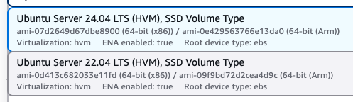

### Choose an instance type - tested with i4, must support nvme devices

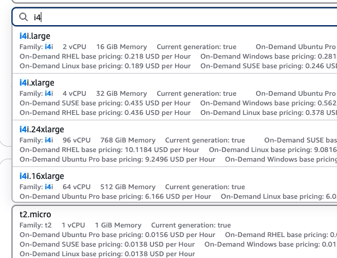

### Create 2 addtional volumes - use io1 for optimal iops performance

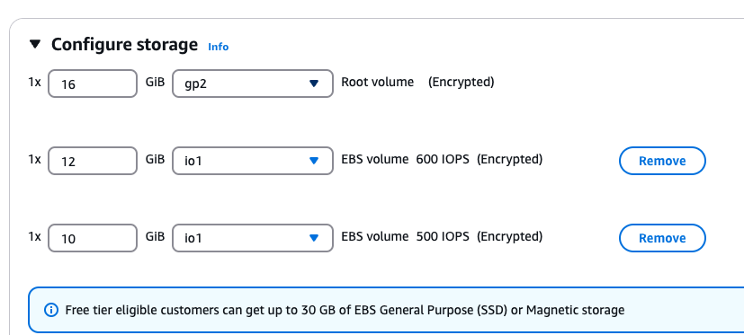

## 2. Deploy the instance

Access the instance from the AWS console

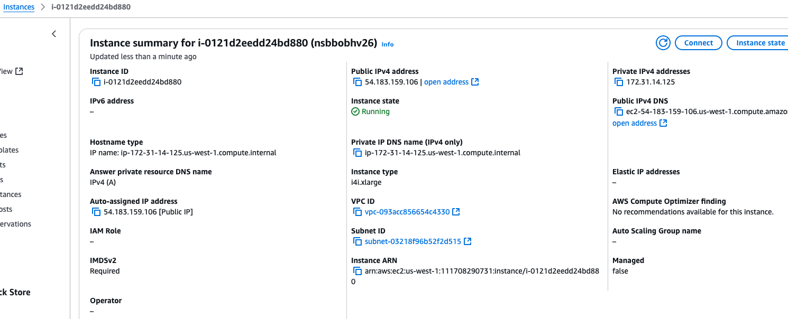

Click the connect tab to see the syntax for an ssh connection. NOTE: need to download the apporpriate key pair (pem file)

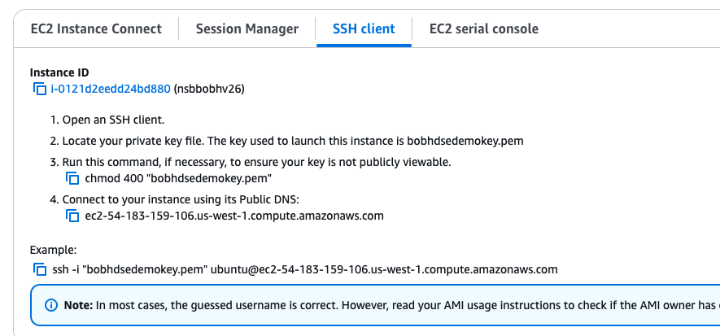

## 3. use ssh to login to the ubuntu vm. Skip this step if installing from mac

```
ssh -i nameOfPEMFile.pem ubuntu@ec2-54-183-159-106.us-west-1.compute.amazonaws.com
```

## 4. Clone the git repo

```
git clone https://github.com/rhardaway/datastax_nsb.git
cd datastax_nsb
```

The tool can be used one of two ways:

### If running from ubuntu:

```
./nsb_install_ubuntu.sh
```

### Or, if running from your local mac and run:

```
./nsb_install_from_mac.sh
```

For the local MAC run, you will need the following info:

```
PEM_FILE='/Users/bob.hardaway/work/install/myec2key.pem'
EC2_Host='ec2-52-53-171-73.us-west-1.compute.amazonaws.com'
USER=ubuntu
```
NOTE: when you first ssh to a node, there is a key check that asks do you want to continue, don't panic, this is natural. It's also pretty natural to get an error, the
most popular one is that the key file permissions are lax.

```
chmod 600 myec2key.pem
```

## 5. Verify things went well:

```
./scripts/verify_install.sh
```

## 6. The script will prompt for:

 - The public dns name of your instance, you can get this in the EC2 console
 - The Grafana API key to allow data to be published to the dashboard. Stay on this prompt and continue with the following steps to generate the key

## 7. Steps required once script completes

Once the script completes, you will need to finish the conf
 - Open ports 8428, 3000, 9042 on the AWS security group
 - Connect to Victoria Metric UI at http://<ip>:8428 
 - Connect to Grafana at http://<ip>:3000 and: 
   - Create a prometheus datasource in Grafana - NOTE determine and use the private ip for the docker process:
        - to determine that ip, use ifconfig and look for the settings for the docker0 interface. will look something like
           - docker0: flags=4163<UP,BROADCAST,RUNNING,MULTICAST>  mtu 1500
           - inet 172.17.0.1  netmask 255.255.0.0  broadcast 172.17.255.255
   - create an service account and api token in the grafana UI - NOTE, make sure to give the SA admin rights
      this token is added to a ~/.nosqlbench/grafana file you create
   -  create or import included dashboard - the example dashboard is setup using 'prometheus' as the 
       datasource name, which is the default in grafana. If you choose a different datasource name, you
       will need to replace the name 'prometheus' in the example dashboard json file.

### Access AWS Console, navigate to your vm, click the security tab and add 3 new rules

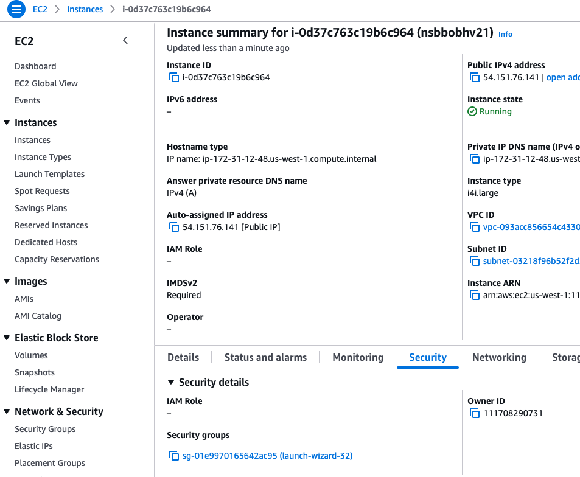


### Create a new Prometheus Connection
   NOTE: Leave the default name 'prometheus' if you change this the nsb config must be changed
   The IP here must be the local IP the Docker container is running on, you can check this by typing this command in the vm: 
   
   ```
   ifconfig
   ```
  and look for the IP under the section docker. it should be something like: 172.17.0.1
  the vm port is 8428 by default

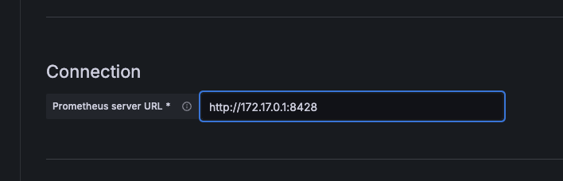

### Test and Save the string

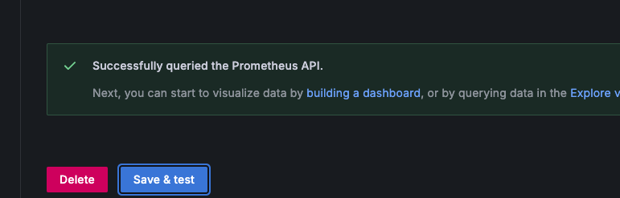

### Create a Service Account.

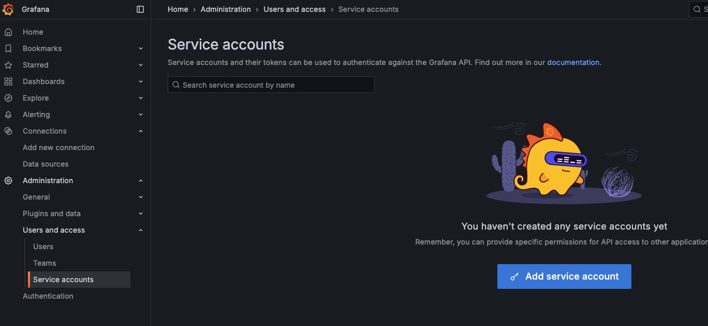
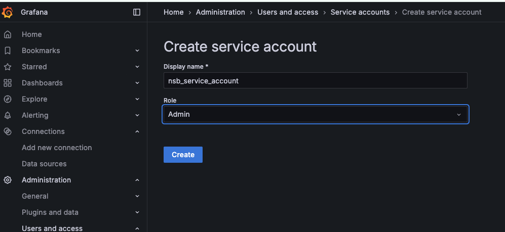

  NOTE: Make sure to select the Admin role for the account. Without this the publisher will NOT have the necessary permissions.

### Create a API Token for the account. Paste this value into the terminal you left above. NOTE you can run the set_grafana_apikey.sh script to set this value in the VM

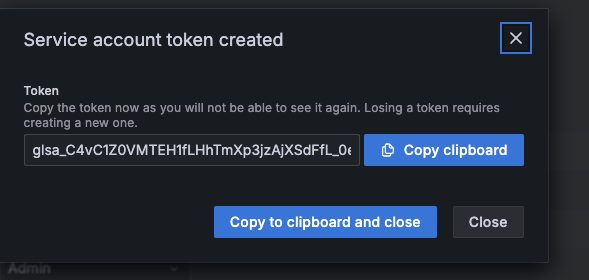

### Import the sample Dashboard. Import button is at the top-right in Grafana UI.
### You may encounter a bug with import, if you do just copy/paste the json

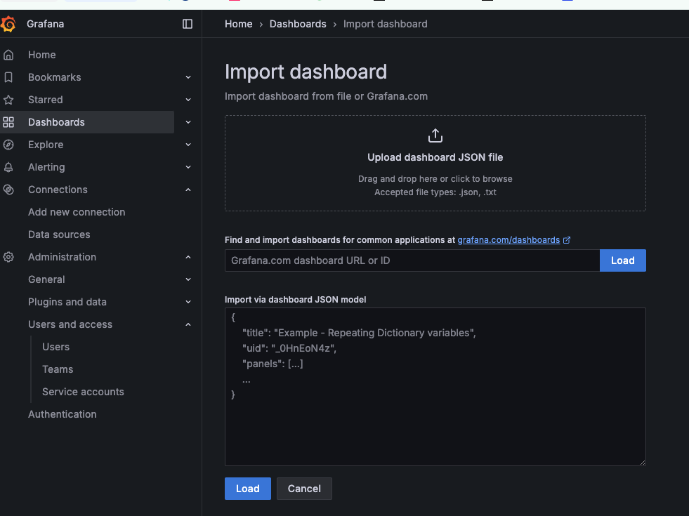
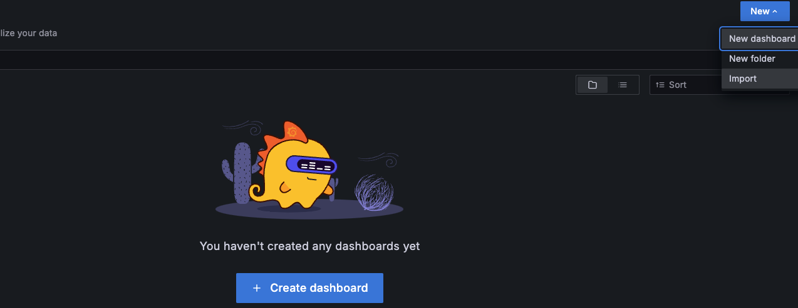
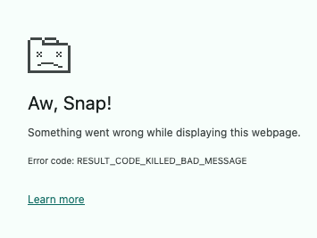
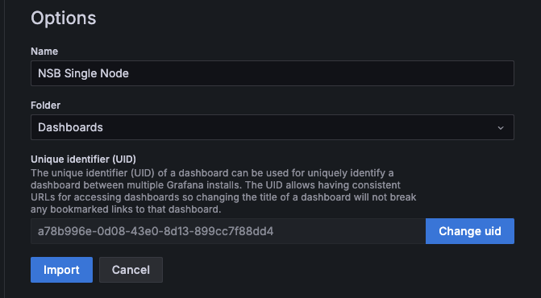

### Run the helper script and enter the api key generated in grafana 

```
> ./set_grafana_apikey.sh
Enter token value:
```

## 4. Nosqlbench smoke tests:

```
> ./scripts/run_nsb_tests.sh
```

#### This will execute the builtin cql_starter test as well as the test included in the test.yaml file
#### Check the nosqlbench doc for more on test execution

### Visit the grafana UI Dashboard to see stats. NOTE: It takes 30sec or more for the dashboard to 
### update once a test is run.
